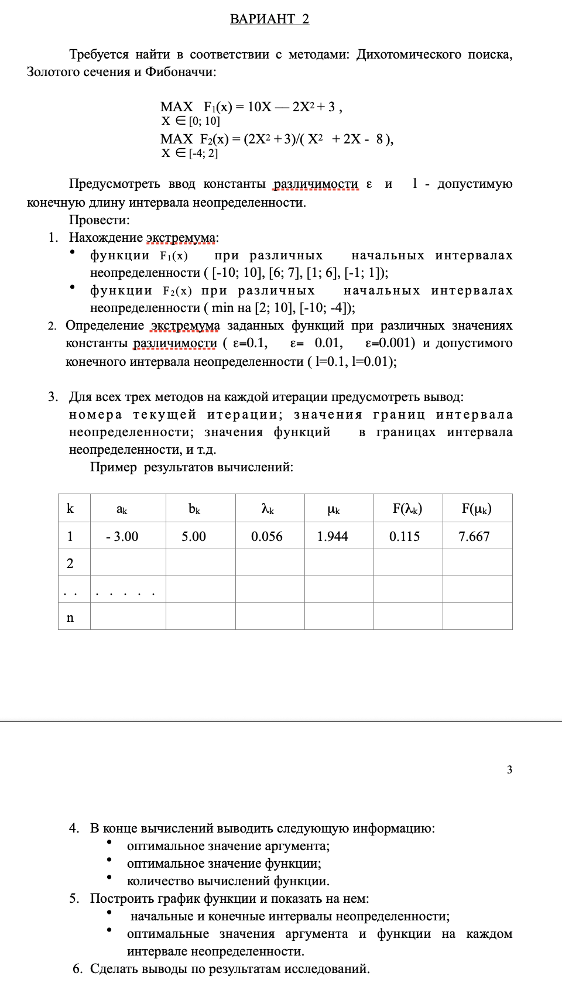

# Лабораторная работа №1 по методам оптимизации

Небольшое desktop-приложение на `PySide6` для одномерного поиска экстремума на отрезке.

Программа позволяет:

- выбрать шаблон функции и менять его коэффициенты;
- искать `max` или `min` на заданном интервале;
- запускать один метод или сразу все методы;
- сравнивать результаты по числу итераций, числу вычислений функции и финальному интервалу;
- просматривать таблицу итераций;
- строить график функции и найденных точек;
- выполнять пакетное исследование по сетке параметров `ε × l`.



## Что здесь происходит

Проект сделан для исследования и сравнения методов одномерной оптимизации:

- дихотомия;
- золотое сечение;
- Фибоначчи.

В приложении доступны два шаблона функций:

- `f(x) = a·x² + b·x + c`
- `f(x) = (a·x² + b·x + c) / (d·x² + e·x + f)`

Шаблон функции выбирается в блоке `Функция`, там же редактируются коэффициенты. Для рациональной функции точки разрыва вычисляются динамически как действительные корни знаменателя, поэтому интервал нельзя задавать так, чтобы он пересекал эти точки.

## Структура проекта

- `lr1/main.py` — точка входа для запуска GUI.
- `lr1/__main__.py` — позволяет запускать пакет командой `python -m lr1`.
- `lr1/domain/` — доменная модель и вычислительная логика.
- `lr1/domain/models.py` — модели данных и отчётов.
- `lr1/domain/functions.py` — шаблоны функций и аналитика по ним.
- `lr1/domain/search.py` — реализация методов поиска.
- `lr1/domain/numerical.py` — общие численные утилиты и правила сравнения.
- `lr1/application/` — use case-слой и подготовка данных для UI.
- `lr1/application/services.py` — валидация ввода, одиночный запуск и пакетное исследование.
- `lr1/application/analysis.py` — аналитические helpers для отчётов и теоретического ориентира.
- `lr1/application/viewmodels.py` — подготовка данных отчёта для UI.
- `lr1/ui/` — визуальный слой приложения.
- `lr1/ui/window.py` — главное окно на `PySide6`.
- `lr1/ui/tabs.py` — отдельные UI-компоненты вкладок `Сводка`, `Итерации`, `График`.
- `lr1/ui/workers.py` — фоновые задачи и обёртка над `QThread`.
- `lr1/ui/plotting.py` — построение графиков через `matplotlib`.
- `lr1/infrastructure/` — инфраструктурные зависимости.
- `lr1/infrastructure/settings.py` — константы и конфигурация экспериментов.
- `lr1/infrastructure/logging.py` — настройка логирования.
- `requirements.txt` — зависимости.
- `theory/` — теоретические материалы.
- `tasks/lr1.png` — задание на 1ю лабораторную работу.

## Требования

- Python `3.10+`
- установленный `pip`

Зависимости проекта:

- `PySide6`
- `matplotlib`

## Установка

Из каталога проекта:

```bash
cd optimmethods
python3 -m venv .venv
source .venv/bin/activate
python -m pip install -r requirements.txt
```

Если виртуальное окружение уже создано, достаточно активировать его и поставить зависимости.

## Запуск

```bash
cd optimmethods
source .venv/bin/activate
python -m lr1
```

Если зависимости не установлены, приложение завершится с подсказкой, какой пакет нужно доставить.

## Как пользоваться

### 1. Выбери сценарий

Слева в блоке `Функция` нужно выбрать шаблон и задать коэффициенты:

- шаблон функции: квадратичная или рациональная;
- коэффициенты выбранной функции.

В блоке `Сценарий` нужно выбрать:

- цель: `Максимум` или `Минимум`;
- алгоритм: один из методов или режим `Все`.

### 2. Задай параметры

В блоке `Параметры` указываются:

- `a` — левая граница интервала;
- `b` — правая граница интервала;
- `ε` — параметр точности;
- `l` — допустимая длина конечного интервала.

### 3. Запусти расчёт

Доступны два режима:

- `Рассчитать` — запускает выбранный метод или все методы на одном наборе параметров;
- `Серия расчётов` — запускает серию расчётов по фиксированной сетке:
  - `ε = 0.1, 0.01, 0.001`
  - `l = 0.1, 0.01`

Кнопка `Очистить` сбрасывает показанные результаты, таблицы и график, не меняя введённые параметры.

### 4. Смотри результат

Вкладки справа:

- `Сводка` — таблица результатов, теоретический ориентир, пропущенные наборы параметров и наблюдения;
- `Итерации` — пошаговая таблица для выбранного метода;
- `График` — график функции и найденных точек.

Если был выбран пакетный режим, на вкладке `Итерации` можно переключаться между конкретными наборами `ε` и `l`.
График отдельной кнопкой обновлять не нужно: он строится автоматически при открытии вкладки `График` и при смене набора параметров в пакетном режиме.

## Как интерпретировать вывод

На вкладке `Сводка` приложение показывает:

- найденную точку `x*`;
- значение функции `f(x*)`;
- число итераций;
- число вызовов функции;
- финальный интервал;
- отклонение от теоретического ориентира, если он вычислен аналитически.

Дополнительно:

- для пакетного режима выводятся все успешные прогоны по сетке `ε × l`;
- отдельно показывается список пропущенных комбинаций параметров;
- в блоке `Выводы` формируются краткие наблюдения по числу вызовов функции и характеру экстремума на интервале.

Это удобно для сравнения методов по скорости и точности на одном и том же интервале.

## Ограничения и проверки

Программа валидирует входные данные и показывает ошибку, если:

- `a >= b`;
- `ε <= 0` или `l <= 0`;
- для метода дихотомии нарушено условие `ε < l`;
- граница интервала попадает в точку разрыва и после сдвига границ интервал становится пустым;
- знаменатель рациональной функции тождественно равен нулю.

В пакетном исследовании невалидные комбинации параметров не роняют приложение: они просто попадают в список пропущенных наборов.

## Логи

Подробный лог пишется в файл:

```text
lr1/infrastructure/logs/lr1_debug.log
```

Там есть:

- запуск приложения;
- параметры расчётов;
- ошибки в рабочих потоках;
- служебная отладочная информация по методам.

## Что сейчас не реализовано

- отдельный CLI-режим без GUI;
- экспорт таблиц и графиков в файл;
- автоматические тесты.

## Коротко

Если нужен самый короткий сценарий:

```bash
cd optimmethods
source .venv/bin/activate
python -m lr1
```

Дальше в окне приложения выбери функцию, интервал, метод и нажми `Рассчитать`.
